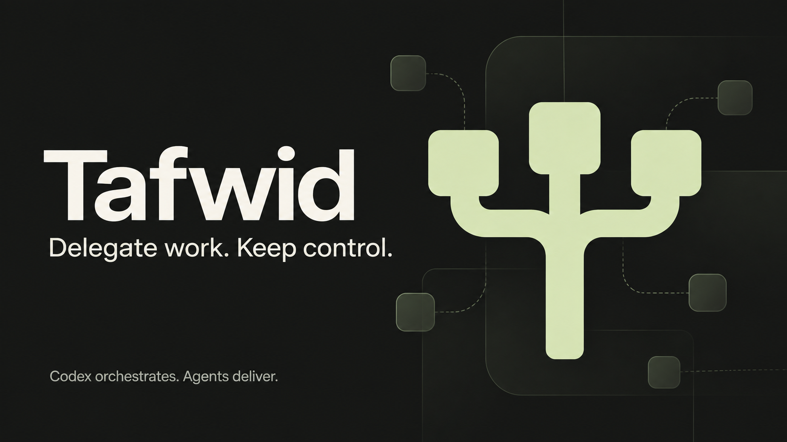

# Tafwid



**Delegate work. Keep control.**

Tafwid lets Codex delegate bounded work to coding agents while retaining task
ownership, independent review and user communication. A local dashboard shows
workers, resumed runs, instructions, results and recorded orchestrator activity.

**Claude Code is the default worker backend.** This checkout also includes an
experimental OpenCode adapter for explicitly selected OpenRouter and OpenCode Zen free models.
It also supports named self-hosted LM Studio and vLLM connections, using local
or private-network inference while OpenCode edits/tests in the current workspace.
Cursor and other backends remain planned. Superpowers and other
workflow plugins are optional; Tafwid can forward relevant worker instructions
without copying the entire parent conversation.

## What it does

- Turn delegation on or off for one Codex task, independently of other tasks.
- Route task types through editable model tiers and overrides.
- Resume a worker in its own session; keep independent reviewers separate.
- Forward selected instructions once, retaining verified unchanged instructions
  on resumes and matching compatible installed skills when possible.
- Wait for completion with compact results instead of repeatedly loading logs.
- Hand unsupported browser or computer actions back to Codex.
- Keep permission choices explicit: Scoped, Full access, or Follow Codex.
- Track workers and their individual runs, with filters, conversation names,
  settings and public Codex activity in a local dashboard.
- Scout free models on OpenRouter and OpenCode Zen, with cached capability-based
  task candidates. Scouting does not launch workers or replace saved routing.
- Inspect input/output, cache and reasoning tokens, cost evidence and effective
  output throughput per worker and run, including available historical results.

Tafwid offloads work; it does not guarantee a percentage reduction in Codex usage.
The orchestrator still spends tokens on briefs, acceptance checks and corrections.

## Requirements

- Codex with plugin support.
- macOS or Linux; Windows process management is not supported in this release.
- Python 3.10 or newer. Runtime uses the standard library only.
- Claude Code on `PATH`, signed in through `claude auth login` with a supported
  Claude subscription. The adapter checks subscription authentication and rejects
  API-key or alternate-provider overrides. Account limits and extra-usage settings
  still apply; Tafwid is not a spending cap.

Node.js is needed only for contributor dashboard tests, not normal use.

For the experimental OpenCode adapter, install OpenCode. Configure an
OpenRouter API key with `opencode auth login`, or choose a free Zen model.
Zen can use public access without a key; configured Zen accounts are also supported.
Claude authentication is not needed
for OpenCode runs. See [OpenCode worker setup](plugins/tafwid/skills/delegate/references/opencode.md).
This adapter requires an explicit `openrouter/provider/model:free` or `opencode/model` ID with tool
calling and verified zero input/output pricing; it checks current pricing and capabilities before dispatch. It does not
fall back to a paid model. Dashboard model presets still configure Claude only.

Self-hosted models use `local-NAME/model` with a user-configured server URL,
served model ID, context/output limits and optional credential reference. These
connections skip hosted free-price catalogues and check the selected server.
They never fall back to cloud inference. See [LM Studio and vLLM setup](plugins/tafwid/skills/delegate/references/local-models.md).
Connection names appear in worker model labels and filters; reported tokens/rate
remain available. Hardware/electricity costs are not estimated. The initial setup
uses a CLI; the dashboard's saved task-tier routes still select Claude models.

## Install

Add this repository as a Codex marketplace and install its plugin:

```sh
codex plugin marketplace add hunainahmedj/tafwid
codex plugin add tafwid@tafwid
```

Start a new Codex task so it discovers the skill entry points. Select one
from the `$` menu, or use its qualified name:

| Skill | Purpose | Example |
| --- | --- | --- |
| `$tafwid:delegate` | Assign work or manage this task's delegation switch | `$tafwid:delegate on` |
| `$tafwid:dashboard` | Open workers, runs and recorded activity | `$tafwid:dashboard` |
| `$tafwid:settings` | View or change model routing and permissions | `$tafwid:settings` |
| `$tafwid:scout` | Find free model candidates for a task | `$tafwid:scout for debugging` |

`$tafwid:delegate off` disables automatic delegation for this task;
`$tafwid:delegate status` reports its switch. A bare delegate invocation also
shows status. To assign work, include the task after `$tafwid:delegate`.
Plain-language requests still work through normal skill discovery.

Dashboard and settings entry points share the existing runtime without loading
the worker workflow. Delegation loads that workflow only when assigning,
resuming or reviewing work. There is a small discovery-metadata cost for the entry-point
skills; this split reduces instruction loading for narrow requests rather than
guaranteeing zero context overhead. The separate scout entry point adds discovery
metadata, but its catalogues and instructions are not loaded for ordinary delegation.

Scouting uses OpenRouter's live model catalogue and cross-checks OpenCode Zen's
live IDs with models.dev. Results are cached locally for six hours; `--refresh`
forces a check. Stale data is explicitly marked after a failed refresh. Suggested
task types are metadata-based candidates, not benchmark scores. Local run outcomes
are shown separately and do not prove acceptance. Worker dispatch checks live
metadata again, including on resumes. Switching providers requires a fresh worker
so an existing conversation is not carried to another provider.

Dashboard usage totals follow the run filters; worker cards include all recorded
runs in that session. Missing usage stays unknown. Claude dollars are API-equivalent
estimates, **not Max subscription charges**; OpenCode dollars are harness-reported,
not verified invoices. Effective throughput divides output by elapsed run time,
including tools and waits, and does not measure model decode speed. Usage normally
appears on completion; interrupted runs and helper calls can be incomplete.

Delegation starts **off**, and permissions default to **Scoped**. Turning it off
prevents new dispatches; it does not cancel an already-running worker. Explicit
one-shot delegation is also supported without changing the task switch.

In Dashboard → Settings, choose model routing and permissions. Current presets
are Sonnet, Opus and Fable; choose aliases available to your Claude account.
An explicit `--model` can select a different alias or exact ID. Tafwid does not
silently substitute another billing provider when a model or quota is unavailable.

### Updating Tafwid

```sh
codex plugin marketplace upgrade tafwid
codex plugin add tafwid@tafwid
```

Start a new Codex task after updating. Version 0.2 replaces `$tafwid:tafwid`
with delegate, dashboard and settings; choose `$tafwid:delegate` for the former
all-purpose entry. Task switches, worker history and settings stay in place.

### Existing claude-delegate users

See [migration](docs/migration.md) before replacing a personal installation.
Existing state is reused in place, including task switches, model overrides and
worker history. Neither installation nor an update should copy private history
into this repository. This package does not edit your global `AGENTS.md` or stop
running workers.

## How delegation works

Codex prepares the task brief and selects relevant role/skill files. The launcher
starts the selected harness, records the run, and returns a compact result. Codex reviews the
actual work before accepting it. Corrections resume the same implementer;
independent reviews use a separate session.

Workers report checks with their tested code state, later edits and outstanding
work. Optional test retries need a relevant change or diagnostic reason; required
CI and independent acceptance checks remain required. These are agent
instructions, not a mechanical guarantee that every worker follows them.

The dashboard uses a loopback HTTP server and a local access token. It has no
separate telemetry service. Worker prompts go to the selected backend under that
backend's configuration; do not assume this makes model inference local.

## Contribute and extend

```sh
git clone https://github.com/hunainahmedj/tafwid.git
cd tafwid
make test
```

Tests use temporary homes and fake worker executables. They do not need provider
accounts or make model requests. See [CONTRIBUTING.md](CONTRIBUTING.md),
[architecture](docs/architecture.md), and [the roadmap](docs/roadmap.md).

Recorded integration results: [OpenRouter](docs/opencode-trial.md),
[OpenCode Zen](docs/zen-trial.md), and [LM Studio/vLLM](docs/local-inference-trial.md).
The [documentation audit](docs/audits/2026-09-21.md) records coverage and limits.

## License

MIT. See [LICENSE](LICENSE). Claude Code, Codex and referenced third-party plugins
are separate products with their own terms; they are not bundled or endorsed by
this project.
