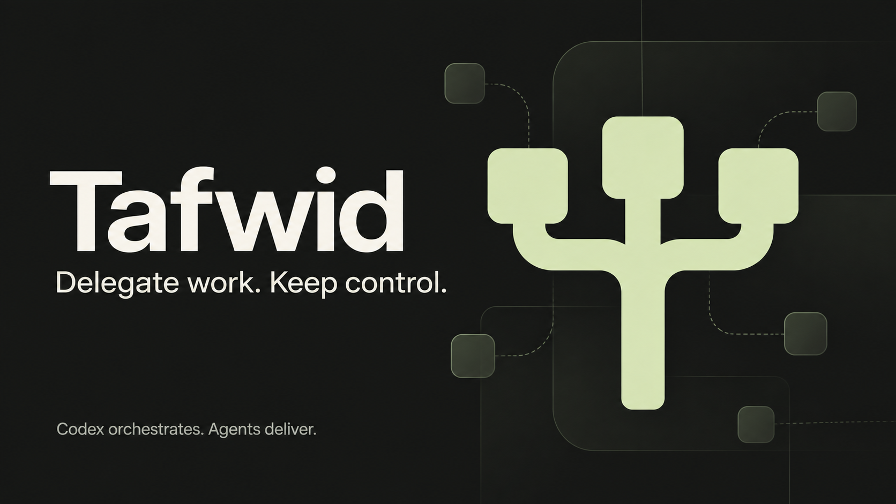

# Tafwid



**Delegate work. Keep control.**

Tafwid lets Codex or Claude Code delegate bounded tasks to Claude Code or named GPT accounts. The
coordinator directs the work and accepts the result using concise reports and relevant checks.

## What it does

- Enable a task-local pool of Claude and named GPT accounts.
- Choose a Claude model explicitly or use saved task-based routing.
- Launch a worker and resume it with corrections.
- Wait for completion without repeatedly loading worker logs.
- Keep permissions explicit: Scoped, Full access, or Follow coordinator.
- Save private briefs, raw results and compact reports for each run.

Delegation does not guarantee lower coordinator usage. Planning, task briefs and
acceptance checks still consume tokens. A Claude Code coordinator and its Claude
workers share one Claude subscription; delegation there saves coordinator context,
not allowance.
See [benchmark findings](docs/benchmarks.md) for measured coordinator, worker and
waiting costs across three task types.

## Requirements

- Codex or Claude Code with plugin support, as the coordinator.
- macOS or Linux and Python 3.10 or newer. No third-party Python packages required.
- Claude Code on `PATH`, signed in through `claude auth login` with a supported
  Claude subscription. API-key and alternate-provider overrides are rejected.
  Account limits and extra-usage settings still apply.
- For GPT workers, Codex CLI on `PATH` and a separate ChatGPT sign-in for each
  named account. See [account setup](docs/account-setup.md).

## Install

### Codex

```sh
codex plugin marketplace add hunainahmedj/tafwid
codex plugin add tafwid@tafwid
```

Start a new Codex task and select a skill from the `$` menu.
After installing or upgrading, open an interactive `codex` session once and
approve Tafwid's hooks (`/hooks`); see [local activity log](#local-activity-log).

### Claude Code

```text
/plugin marketplace add hunainahmedj/tafwid
/plugin install tafwid@tafwid
```

Start a new session and invoke a skill with `/`.

### Skills

| Skill | Purpose | Example |
| --- | --- | --- |
| `$tafwid:delegate` or `/tafwid:delegate` | Assign work or manage this task's switch | `$tafwid:delegate on` |
| `$tafwid:account` or `/tafwid:account` | Add and check named GPT accounts | `$tafwid:account add gpt business` |

Invoking the delegate skill with no arguments reports status. Delegation starts off. Turning it off
prevents new automatic dispatches; running workers continue. An explicit one-time
assignment is also supported without changing the switch.

For updates in Codex, run `codex plugin marketplace upgrade tafwid`, reinstall the plugin,
and start a new task. In Claude Code, run `/plugin marketplace update tafwid` and start a
new session. See [migration](docs/migration.md) for existing installations.

## How to use it

The coordinator writes a brief with the goal, workspace, constraints and acceptance criteria.
The launcher starts the selected worker and returns a compact result. Corrections resume the
same worker; an independent review, when needed, uses a separate worker.

Use the [shared workflow](plugins/tafwid/skills/delegate/references/workflow.md),
[Claude Code guide](plugins/tafwid/skills/delegate/references/claude-code.md),
and [GPT account guide](plugins/tafwid/skills/delegate/references/gpt-accounts.md).
Each public script supports `--help`.

To let Tafwid resume Codex when a worker finishes, review and trust Tafwid's
hooks in Codex (`/hooks` in the CLI). Without hook trust, the workflow uses
`wait.py` instead. Claude Code runs plugin hooks without a trust step; if hooks
are disabled, the workflow uses `wait.py` there too.

Claude worker permissions default to Scoped. `settings.py show` shows its saved
model routes and can change its permissions. GPT workers use read-only or
workspace-write sandboxes. Use `--model` for an explicit model choice.
Tafwid does not silently change billing providers when a model is unavailable.

Switches, settings, named accounts and run records are kept in `~/.tafwid/state`
and shared by both coordinators. An installation from before 0.4 keeps using its
directory under the Codex home until you run `settings.py migrate`; see
[migration](docs/migration.md).

Run artifacts stay in the caller's private output directory. Tafwid does not
fetch account allowances. Keep private evidence outside Git. Worker prompts are
sent through the selected CLI; inference is not necessarily local.

## Local activity log

Tafwid can keep a private log of what your agents are doing, so a local
viewer can show every session and sub-agent. It is off by default and
nothing is written until you turn it on. It works whether delegation is on
or off and adds no tokens: background hooks write it and the model never
sees them. From a clone of this repository:

```sh
python3 plugins/tafwid/skills/delegate/scripts/world.py on      # start logging
python3 plugins/tafwid/skills/delegate/scripts/world.py off     # stop logging
python3 plugins/tafwid/skills/delegate/scripts/world.py status  # show whether it is on
```

In an installed plugin the same script is in the delegate skill's
`scripts/` directory, for example
`~/.codex/plugins/cache/tafwid/tafwid/<version>/skills/delegate/scripts/world.py`
for Codex. You can also ask the coordinator to run it through the delegate skill.

The log lives in `~/.tafwid/state/world` (`$TAFWID_HOME/state/world`) and
keeps 7 days. It records the kind of each event, the project folder name and
a short worker label. It never records prompts, file contents, commands or raw
ids. See the [activity log module](docs/04-modules/activity-log.md) for the
exact fields.

**Codex: approve the new hooks after installing or upgrading.** Codex trusts
hooks one handler at a time, not per file, and asks again whenever
`hooks.json` changes. After installing or upgrading to 0.5.0, only the earlier
completion handlers are trusted. Non-interactive `codex exec` silently skips untrusted
handlers, so nothing is logged and no error is written. Open an interactive
`codex` session once and approve Tafwid's new hooks (`/hooks`) before you
expect Codex activity in the log. Claude Code needs no trust step.

Codex runs the `SessionEnd` hook synchronously even though it is declared
asynchronous, with its timeout cut to 3 seconds, and prints a warning saying
so. This is harmless: the hook finishes in about 30 ms.

## Contribute

The [project documentation](docs/README.md) covers the runtime, the activity log and the
local dashboard prototype, which is not part of the plugin.

Run `make test` for package checks and offline Python tests. Tests use temporary
homes and fake workers; they do not make model requests. See
[CONTRIBUTING.md](CONTRIBUTING.md) and [architecture](docs/architecture.md).

## License

MIT. See [LICENSE](LICENSE). Claude Code and Codex are separate products with
their own terms and are not bundled or endorsed by this project.
